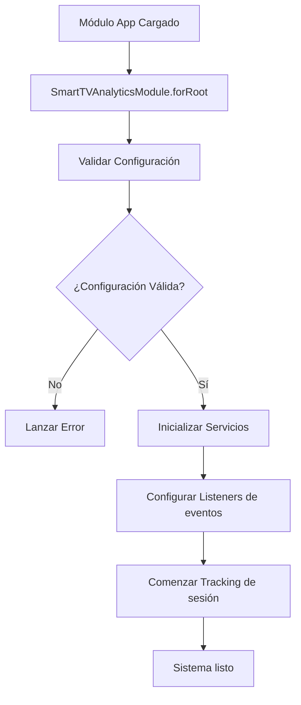
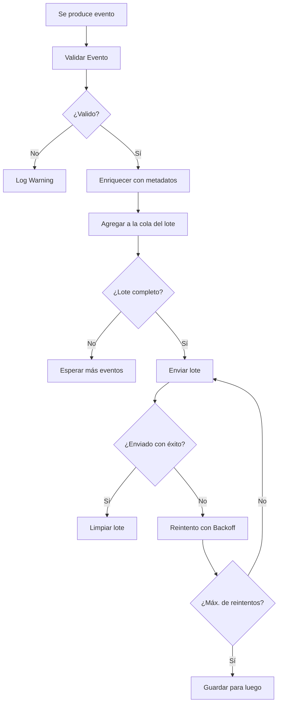
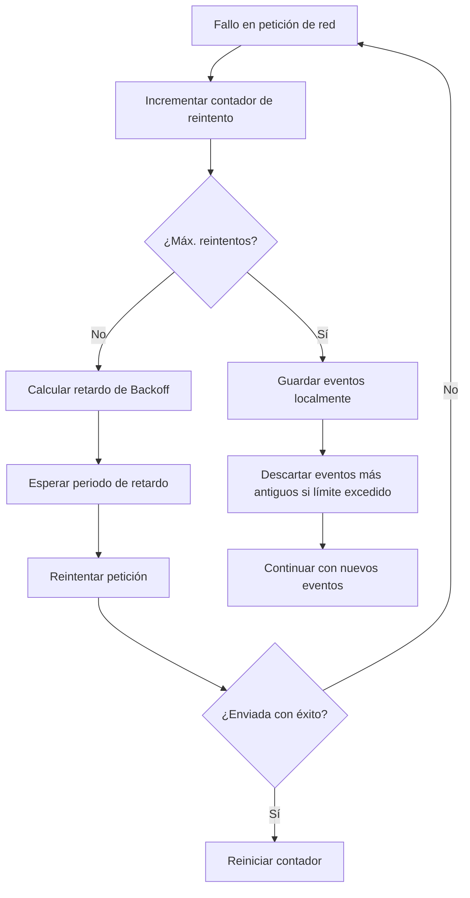

# Análisis funcional - Smart TV Analytics

## Visión general

Este documento presenta un análisis funcional completo de la librería Smart TV Analytics, incluyendo casos de uso, requisitos funcionales y no funcionales, flujos de negocio y especificaciones técnicas.

## Índice

- [Contexto del negocio](#contexto-del-negocio)
- [Casos de uso](#casos-de-uso)
- [Requisitos funcionales](#requisitos-funcionales)
- [Requisitos no funcionales](#requisitos-no-funcionales)
- [Flujos de proceso](#flujos-de-proceso)
- [Especificaciones técnicas](#especificaciones-técnicas)
- [Matriz de trazabilidad](#matriz-de-trazabilidad)

## Contexto del negocio

### Problemática

Las aplicaciones de Smart TV enfrentan desafíos únicos para implementar analytics:

1. **Limitaciones técnicas**:
   - Navegadores con capacidades limitadas
   - APIs web no disponibles (IndexedDB, Service Workers)
   - Conectividad de red intermitente
   - Recursos de memoria y CPU limitados

2. **Problemática de CORS**:
   - Políticas restrictivas en navegadores de TV
   - Imposibilidad de realizar requests directos a Firebase
   - Necesidad de estrategias alternativas de envío

3. **Falta de herramientas especializadas**:
   - Librerías existentes no optimizadas para TV
   - Configuraciones genéricas inadecuadas
   - Sin soporte para ES5/transpilación automática

### Objetivos del negocio

1. **Habilitar analíticas**: Proporcionar una solución completa para analíticas en Smart TVs
2. **Optimización de rendimiento**: Maximizar eficiencia en entornos con recursos limitados
3. **Facilidad de integración**: API simple y configuración mínima
4. **Compatibilidad universal**: Soporte para todas las plataformas de Smart TV
5. **Escalabilidad**: Soportar desde aplicaciones pequeñas hasta plataformas grandes

## Casos de uso

### CU-001: Configuración inicial

**Actor**: Desarrollador de Smart TV
**Objetivo**: Configurar analytics en una aplicación Angular para Smart TV

**Flujo principal**:
1. Desarrollador instala la librería via npm
2. Importa SmartTVAnalyticsModule en AppModule
3. Configura con credenciales de Firebase GA4
4. Selecciona configuración optimizada para su plataforma
5. La librería se inicializa automáticamente
6. Eventos automáticos comienzan a enviarse

**Postcondiciones**: 
- Módulo de analíticas configurado y funcional
- Tracking automático activo
- Dashboard de Firebase recibiendo datos

### CU-002: Tracking de interacciones de video

**Actor**: Usuario final de Smart TV
**Objetivo**: Rastrear comportamiento de visualización de video

**Flujo principal**:
1. Usuario navega a reproductor de video
2. Sistema registra evento 'video_start'
3. Usuario reproduce video
4. Sistema registra evento 'video_play' con metadata
5. Durante reproducción, sistema registra eventos de progreso
6. Usuario pausa video
7. Sistema registra evento 'video_pause' con posición
8. Usuario completa video
9. Sistema registra evento 'video_complete'

**Eventos generados**:
- `video_start`
- `video_play`
- `video_progress` (cada 30 segundos)
- `video_pause`
- `video_seek`
- `video_complete`

### CU-003: Tracking de navegación

**Actor**: Usuario final de Smart TV
**Objetivo**: Rastrear navegación entre pantallas

**Flujo principal**:
1. Usuario navega entre secciones de la app
2. Sistema detecta cambio de ruta (Angular Router)
3. Sistema registra evento 'screen_view' automáticamente
4. Sistema calcula tiempo de engagement en pantalla anterior
5. Sistema registra evento 'engagement' con duración

**Eventos generados**:
- `screen_view`
- `page_view`
- `engagement`

### CU-004: Manejo de conectividad intermitente

**Actor**: Sistema
**Objetivo**: Gestionar envío de eventos con conectividad inestable

**Flujo principal**:
1. Sistema detecta fallo de red al enviar batch de eventos
2. Sistema implementa estrategia de retry con backoff exponencial
3. Sistema almacena eventos localmente durante fallo
4. Sistema detecta recuperación de conectividad
5. Sistema reenvía eventos almacenados
6. Sistema reanuda envío normal

**Flujo alternativo - fallo persistente**:
1. Sistema alcanza límite máximo de reintentos
2. Sistema descarta eventos más antiguos
3. Sistema mantiene eventos más recientes en cache
4. Sistema continúa intentando con nuevos eventos

### CU-005: Depuración y desarrollo

**Actor**: Desarrollador
**Objetivo**: Depurar implementación de analíticas

**Flujo principal**:
1. Desarrollador habilita modo debug
2. Sistema muestra logs detallados en consola
3. Desarrollador habilita modo mock
4. Sistema simula envío sin hacer requests reales
5. Desarrollador puede inspeccionar eventos generados
6. Sistema proporciona métricas de rendimiento

### CU-006: Configuración multiplataforma

**Actor**: Desarrollador
**Objetivo**: Optimizar configuración para múltiples plataformas de TV

**Flujo principal**:
1. Desarrollador detecta plataforma de TV
2. Sistema aplica configuración optimizada automáticamente
3. Para Tizen: configuración con timeouts extendidos
4. Para webOS: configuración con batch sizes optimizados
5. Para desarrollo: configuración con debug habilitado

## Requisitos funcionales

### RF-001: Gestión de configuración

| ID | Descripción | Prioridad |
|----|-------------|-----------|
| RF-001.1 | El sistema debe permitir configuración via `forRoot()` | Alta |
| RF-001.2 | El sistema debe soportar configuraciones predefinidas | Alta |
| RF-001.3 | El sistema debe validar configuración al inicializar | Media |
| RF-001.4 | El sistema debe permitir configuración dinámica en runtime | Baja |

### RF-002: Tracking de eventos

| ID | Descripción | Prioridad |
|----|-------------|-----------|
| RF-002.1 | El sistema debe enviar eventos a Firebase GA4 | Alta |
| RF-002.2 | El sistema debe soportar eventos personalizados | Alta |
| RF-002.3 | El sistema debe enriquecer eventos con metadata automática | Media |
| RF-002.4 | El sistema debe validar parámetros de eventos | Media |

### RF-003: Eventos automáticos

| ID | Descripción | Prioridad |
|----|-------------|-----------|
| RF-003.1 | El sistema debe rastrear sesiones automáticamente | Alta |
| RF-003.2 | El sistema debe rastrear navegación automáticamente | Alta |
| RF-003.3 | El sistema debe rastrear engagement automáticamente | Media |
| RF-003.4 | El sistema debe permitir desactivar eventos automáticos | Baja |

### RF-004: Envío por lotes y optimización

| ID | Descripción | Prioridad |
|----|-------------|-----------|
| RF-004.1 | El sistema debe agrupar eventos en batches | Alta |
| RF-004.2 | El sistema debe enviar batches por tiempo o cantidad | Alta |
| RF-004.3 | El sistema debe optimizar requests de red | Media |
| RF-004.4 | El sistema debe soportar compression de payloads | Baja |

### RF-005: Gestión de errores

| ID | Descripción | Prioridad |
|----|-------------|-----------|
| RF-005.1 | El sistema debe implementar retry con backoff | Alta |
| RF-005.2 | El sistema debe almacenar eventos fallidos localmente | Media |
| RF-005.3 | El sistema debe continuar funcionando ante fallos | Alta |
| RF-005.4 | El sistema debe reportar métricas de salud | Baja |

### RF-006: Estrategias de envío

| ID | Descripción | Prioridad |
|----|-------------|-----------|
| RF-006.1 | El sistema debe soportar envío directo | Alta |
| RF-006.2 | El sistema debe soportar envío via proxy | Media |
| RF-006.3 | El sistema debe soportar modo mock | Media |
| RF-006.4 | El sistema debe permitir estrategias personalizadas | Baja |

## Requisitos no funcionales

### RNF-001: Rendimiento

| ID | Descripción | Métrica | Prioridad |
|----|-------------|---------|-----------|
| RNF-001.1 | Tamaño de bundle mínimo | < 50KB gzipped | Alta |
| RNF-001.2 | Tiempo de inicialización | < 100ms | Alta |
| RNF-001.3 | Uso de memoria | < 5MB en runtime | Media |
| RNF-001.4 | CPU usage en idle | < 1% | Media |

### RNF-002: Compatibilidad

| ID | Descripción | Métrica | Prioridad |
|----|-------------|---------|-----------|
| RNF-002.1 | Soporte ES5 | 100% compatible | Alta |
| RNF-002.2 | Soporte Angular | 12+ | Alta |
| RNF-002.3 | Soporte Tizen | 2.4+ | Alta |
| RNF-002.4 | Soporte webOS | 3.0+ | Alta |

### RNF-003: Confiabilidad

| ID | Descripción | Métrica | Prioridad |
|----|-------------|---------|-----------|
| RNF-003.1 | Disponibilidad del servicio | 99.9% | Alta |
| RNF-003.2 | Tasa de éxito de eventos | > 95% | Alta |
| RNF-003.3 | Recuperación ante fallos | < 30 segundos | Media |
| RNF-003.4 | Persistencia de datos | 24 horas | Media |

### RNF-004: Seguridad

| ID | Descripción | Prioridad |
|----|-------------|-----------|
| RNF-004.1 | Encriptación de datos en tránsito (HTTPS) | Alta |
| RNF-004.2 | Validación de entrada de datos | Alta |
| RNF-004.3 | No exposición de API secrets | Alta |
| RNF-004.4 | Anonimización de datos personales | Media |

### RNF-005: Usabilidad

| ID | Descripción | Prioridad |
|----|-------------|-----------|
| RNF-005.1 | API simple e intuitiva | Alta |
| RNF-005.2 | Configuración mínima requerida | Alta |
| RNF-005.3 | Documentación completa | Media |
| RNF-005.4 | Ejemplos de uso | Media |

## Flujos de proceso

### Flujo 1: Inicialización del sistema



### Flujo 2: Procesamiento de eventos



### Flujo 3: Manejo de conectividad



## Especificaciones técnicas

### Arquitectura de componentes

```typescript
interface SystemArchitecture {
  presentation: {
    module: 'SmartTVAnalyticsModule';
    publicAPI: 'SmartTVAnalyticsService';
  };
  
  business: {
    eventProcessing: 'EventBatchingService';
    sessionManagement: 'SessionService';
    deviceDetection: 'DeviceInfoService';
  };
  
  infrastructure: {
    storage: 'StorageService';
    networking: 'HttpClient';
    configuration: 'InjectionToken';
  };
}
```

### Modelo de datos

```typescript
interface AnalyticsEvent {
  name: string;                    // Nombre del evento (requerido)
  params?: EventParameters;        // Parámetros del evento
  timestamp_micros?: number;       // Timestamp en microsegundos
}

interface EventParameters {
  [key: string]: string | number | boolean;
}

interface MeasurementPayload {
  client_id: string;              // ID único del cliente
  user_id?: string;               // ID del usuario (opcional)
  events: AnalyticsEvent[];       // Array de eventos
  user_properties?: UserProperties;
}

interface SessionInfo {
  sessionId: string;
  startTime: number;
  lastActivityTime: number;
  engagementTime: number;
  isFirstSession: boolean;
}

interface DeviceInfo {
  platform: string;              // tizen, webos, etc.
  userAgent: string;
  screenResolution: string;
  language: string;
  timezone: string;
}
```

### API

```typescript
interface SmartTVAnalyticsService {
  // Configuración
  initialize(config: SmartTVAnalyticsConfig): void;
  
  // Eventos
  logEvent(eventName: string, parameters?: EventParameters): Promise<void>;
  
  // Usuario
  setUserId(userId: string): void;
  setUserProperties(properties: UserProperties): void;
  
  // Control
  enableCollection(enabled: boolean): void;
  
  // Información
  getClientId(): string;
  getSessionInfo(): SessionInfo;
}

interface EventBatchingService {
  initialize(config: SmartTVAnalyticsConfig): void;
  addEvent(event: AnalyticsEvent): void;
  flush(): Promise<void>;
  getQueueSize(): number;
}

interface SessionService {
  initialize(): void;
  startSession(): void;
  endSession(): void;
  getSessionInfo(): SessionInfo;
  updateLastActivity(): void;
}
```

### Configuración del sistema

```typescript
interface SmartTVAnalyticsConfig {
  // Firebase
  measurementId: string;          // GA4 Measurement ID
  apiSecret: string;              // Measurement Protocol API Secret
  
  // App Info
  appName: string;
  appVersion: string;
  
  // Comportamiento
  enableDebugMode?: boolean;
  batchSize?: number;             // Default: 10
  flushInterval?: number;         // Default: 30000ms
  requestTimeout?: number;        // Default: 15000ms
  maxRetryAttempts?: number;      // Default: 3
  
  // Eventos Automáticos
  enablePageViewTracking?: boolean;    // Default: true
  enableSessionTracking?: boolean;     // Default: true
  enableEngagementTracking?: boolean;  // Default: true
  
  // Estrategias
  sendingStrategy?: 'direct' | 'proxy' | 'mock' | 'gtag';
  proxyUrl?: string;
  mockMode?: boolean;
  
  // Personalización
  customUserAgent?: string;
  defaultParameters?: EventParameters;
}
```

## Matriz de trazabilidad

### Casos de uso vs requisitos funcionales

| Caso de Uso | RF-001 | RF-002 | RF-003 | RF-004 | RF-005 | RF-006 |
|-------------|---------|---------|---------|---------|---------|---------|
| CU-001 | &check; | &cross; | &check; | &cross; | &cross; | &check; |
| CU-002 | &cross; | &check; | &check; | &check; | &cross; | &cross; |
| CU-003 | &cross; | &check; | &check; | &check; | &cross; | &cross; |
| CU-004 | &cross; | &cross; | &cross; | &check; | &check; | &cross; |
| CU-005 | &check; | &check; | &cross; | &cross; | &cross; | &check; |
| CU-006 | &check; | &cross; | &cross; | &cross; | &cross; | &cross; |

### Requisitos vs componentes

| Requisito | SmartTVAnalyticsService | EventBatchingService | SessionService | DeviceInfoService | StorageService |
|-----------|------------------------|---------------------|----------------|------------------|----------------|
| RF-001 | &check; | &cross; | &cross; | &cross; | &cross; |
| RF-002 | &check; | &check; | &cross; | &check; | &cross; |
| RF-003 | &check; | &cross; | &check; | &cross; | &cross; |
| RF-004 | &cross; | &check; | &cross; | &cross; | &cross; |
| RF-005 | &check; | &check; | &cross; | &cross; | &check; |
| RF-006 | &check; | &check; | &cross; | &cross; | &cross; |

### Métricas de éxito

| Indicador | Valor objetivo | Método de medición |
|-----------|----------------|-------------------|
| Tiempo de implementación | < 30 minutos | Tiempo desde instalación hasta primer evento |
| Adopción de desarrolladores | > 80% satisfacción | Encuestas post-implementación |
| Performance impact | < 2% overhead | Benchmarks de performance |
| Tasa de eventos exitosos | > 95% | Logs de analytics en producción |
| Cobertura de pruebas | > 85% | Herramientas de coverage |
| Documentación completeness | 100% API coverage | Review manual |
